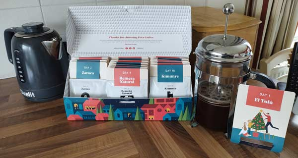

# AoC 2022

React front end scaffolded in NextJS.

## Advent Of Coffee

Courtesy of a rather lovely Christmas present, this years Advent of Code will be powered by an advent of coffee. I'll try to record tasting notes each day.

## Days

* [Day 1](lib/days/day1)
* [Day 2](lib/days/day2)
* [Day 3](lib/days/day3)
* [Day 4](lib/days/day4)
* [Day 5](lib/days/day5)
* [Day 6](lib/days/day6)
* [Day 7](lib/days/day7)
* [Day 8](lib/days/day8)
* [Day 9](lib/days/day9)
* [Day 10](lib/days/day10)
* [Day 11](lib/days/day11)
* [Day 12](lib/days/day12)
* [Day 13](lib/days/day13)
* [Day 14](lib/days/day14)
* [Day 15](lib/days/day15)
* [Day 16](lib/days/day16)
* [Day 17](lib/days/day17)
* [Day 18](lib/days/day18)
* [Day 19](lib/days/day19)
* [Day 20](lib/days/day20)
* [Day 21](lib/days/day21)
* [Day 22](lib/days/day22)
* [Day 23](lib/days/day23)
* [Day 24](lib/days/day24)
* [Day 25](lib/days/day25)
